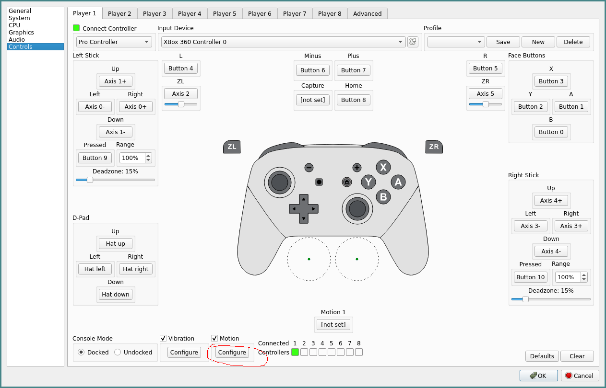
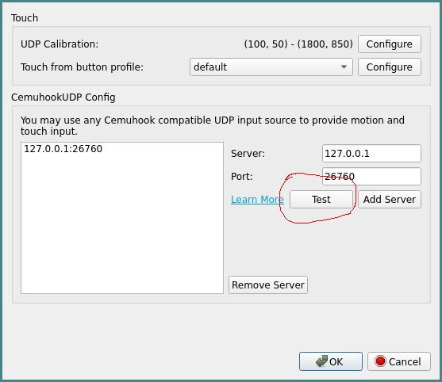
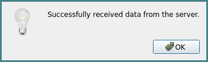
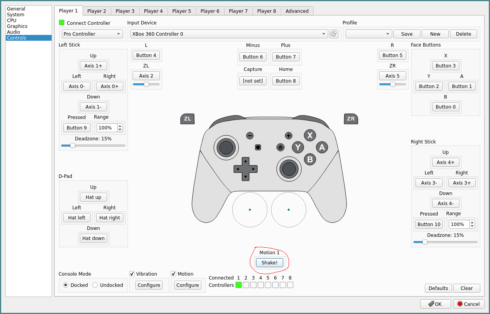
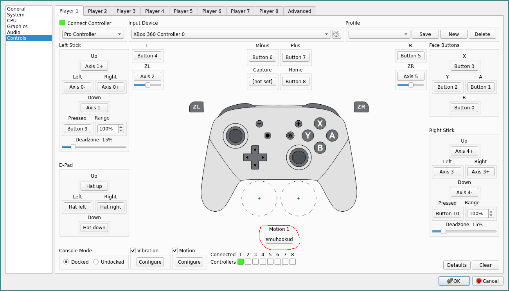

<!--

---
title: "Yuzu: Using a phone to emulate motion controls"
date: 2022-01-03T18:24:20-08:00
draft: false
tags: ["emulation"]
---

-->

Emulating Switch games but can't get your Joy-Cons to connect to your
computer? Without other such controllers, you might be unable to use motion
controls.

Fortunately, if you're using [Yuzu](https://yuzu-emu.org/), you can use your
phone to handle motion controls. In my experience, this is
somewhat janky but relatively usable.

# 1. Download and run WebGyroForCemuhook

[WebGyroForCemuhook](https://github.com/hjmmc/WebGyroForCemuhook) uses
ondevicemotion data to provide the gyroscopic data for a UDP-based,
Cemuhook-compatible motion server.

The README for this project already provides instructions on how to download
run it, but I'll describe how to use it anyways.

If you're on Windows, WebGyroForCemuhook provides a `Gyro.exe` executable
for you to use.

If you're running Linux (as I am), you can install Node.js and use
that to run the project.

After installing Node.js, the following commands should work:

```
git clone https://github.com/hjmmc/WebGyroForCemuhook
cd WebGyroForCemuhook
npm install
npm start
```
Now that you have WebGyroForCemuhook running, you need to connect your phone
to the project's browser front-end. You can do this by pointing your phone's
browser to https://your-pc-ip-ip.xip.lhjmmc.cn:8443 (for example,
https://192-168-1-100.xip.lhjmmc.cn:8443).

If you're using an iPhone and have iOS 13+, you may need to click an "allow
permission" button to use the phone's gyroscope.

# 2. Test the Cemuhook server on Yuzu

To test if WebGyroForCemuhook's UDP server is working properly, go to
`Emulation > Configure > Controls` and then click the `Configure` button under
`Motion`.



From here, you can click the `Test` button without adding any additonal
servers, as the pre-existing server address and port is used by default in
WebGyroForCemuhook.



If the server is working correctly, then you should see a pop-up window saying
"Successfully received data from the server."



# 3. Enable the motion controls on Yuzu

Now that Yuzu is able to receive input from the UDP server, it might seem like
our work is done. However, we still need to configure the controls to actually
use the gyroscopic info from the UDP server.

To do this, click on the "[not set]" controls button for your relevant motion.
For the Pro Controller, this would be the button for `Motion 1`.


The button's text should change to say something like "Shake!".



While the button's text says "Shake!", you should then shake your phone. If
everything works correctly, the button should now read "emuhookudp" or
something similar.



At this point, you should be ready to use your phone for motion controls.

